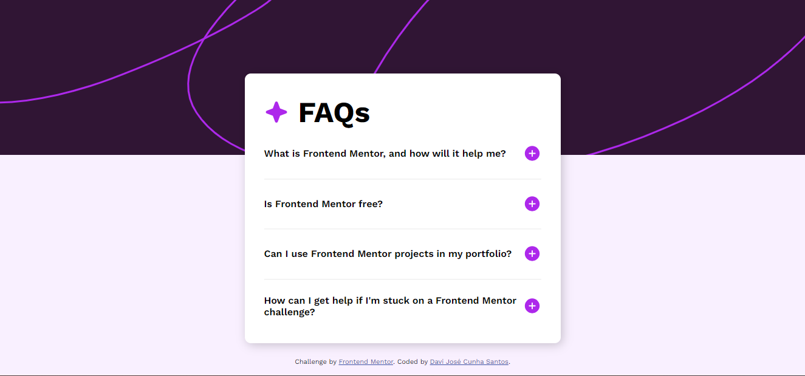

# Frontend Mentor - FAQ accordion solution

This is a solution to the [FAQ accordion challenge on Frontend Mentor](https://www.frontendmentor.io/challenges/faq-accordion-wyfFdeBwBz). Frontend Mentor challenges help you improve your coding skills by building realistic projects. 

## Table of contents

- [Overview](#overview)
- [The Challenge](#the-challenge)
- [Screenshot](#screenshot)
- [Links](#links)
- [My process](#my-process)
- [Built with](#built-with)
- [What I learned](#what-i-learned)
- [Continued development](#continued-development)
- [Useful resources](#useful-resources)
- [Author](#author)

## Overview

### The challenge

Users should be able to:

- Hide/Show the answer to a question when the question is clicked
- Navigate the questions and hide/show answers using keyboard navigation alone
- View the optimal layout for the interface depending on their device's screen size
- See hover and focus states for all interactive elements on the page

### Screenshot



### Links

- Solution URL: [Solution](https://github.com/Dex64ter/FAQ)
- Live Site URL: [The project](https://dex64ter.github.io/FAQ/)

## My process

### Built with

- Semantic HTML5 markup
- CSS custom properties
- Flexbox
- CSS Grid
- Mobile-first workflow

### What I learned

The Html file is basic but is important use acessibility tags to improve the understanding

```html
<p class="backgroundDiv">
</p>

<main class="container">
    <h1>  FAQs </h1>
  
    <section class="ask-question">
      <strong> What is Frontend Mentor, and how will it help me? </strong>
      <span class="answers">
        Frontend Mentor offers realistic coding challenges to help developers improve their frontend coding skills with projects in HTML, CSS, and JavaScript. It's suitable for all levels and ideal for portfolio building.
      </span>
      <hr>
    </section>
</main>
```

Above is an example of one answer with all the tags that I use to implementation, the first tag \<p>\</p>,  I used to style the background image in the design.

```css
.backgroundDiv {
  position: absolute;

  background-image: url('./assets/images/background-pattern-desktop.svg');
  width: 100%;
  height: 16rem;
  top: 0;
  z-index: -1;
}
```

Some interesting things that I done is the animation and the optimal layout to different medias.

```css
/* Medias */
@media (max-width: 720px) {
  .container {
    margin-right: 1.5rem;
    margin-left: 1.5rem;
    padding: 1.8rem 1.5rem 1.8rem;
  }

  .ask-question {
    margin-top: 1rem;
    gap: 1rem;
  }
}

/* Keyframes */

@keyframes changeButton {
  0% {
    transform: rotateY(0);
  }
  100% {
    transform: rotateY(180deg);
  }
}
```

This part of styles is interesting to better user experience.

Finally, we have the scripts where I create a function to change the image button on a click, tha __toggle()__ function is great to study to understand the change of states.

And of course the **sections.forEach()** to use a **EventListener** in each of them.

```js
var sections = document.querySelectorAll(".ask-question")

sections.forEach((section, index) => {
  section.addEventListener('click', () => {
    handleButton(index)
    section.classList.toggle('active')
  })
})
```

### Continued development

I intend to continue the development of this project front-end but using different ways, like react or nextJS because is a pratical project and easy to change the techs.

### Useful resources

- [Animation](https://www.w3schools.com/css/css3_animations.asp) - This helped me for create the animation of the answers that I didn't know. I really liked this pattern and will use it going forward, there are others librarys in ifferents frameworks that I intend use too.
- [React](https://react.dev) - The official react's site that introduce us to the framework , It will help to implement the whole project.


## Author

- Website - [Davi (Dex64ter) Santos](https://www.dex64ter.github.io)
- Frontend Mentor - [@Dex64ter](https://www.frontendmentor.io/profile/Dex64ter)
- Instagram - [@davijozedjs](https://www.instagram.com/davijozedjs/)


